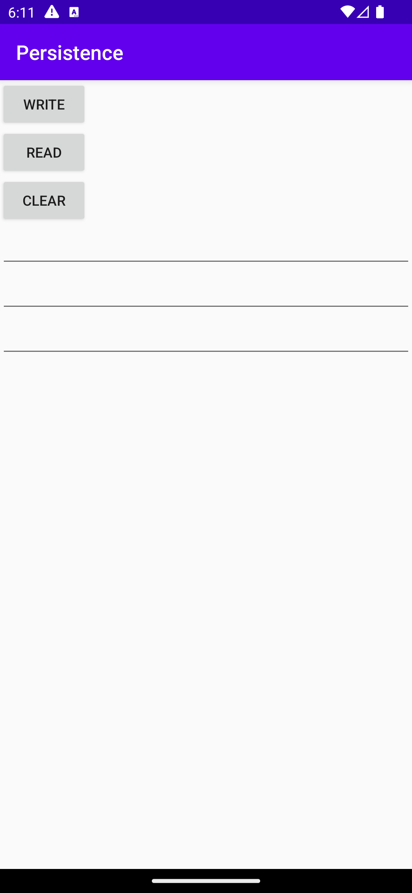
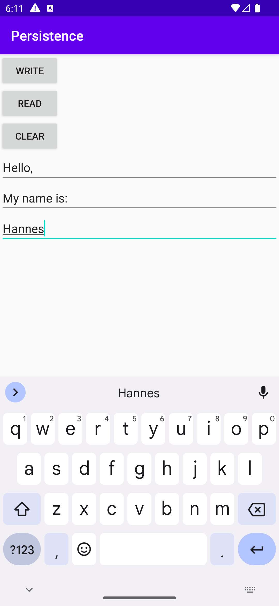

# Rapport

Applikationens uppgift är att skapa en databas i SQLite där data kan skrivas och läsas. 

Här skapas databasen. I `DATABASE_CREATE` skapas SQL-queryn för att skapa databasen.  
```
public class DatabaseHelper extends SQLiteOpenHelper {
    private static final String DATABASE_CREATE = "create table MyTable ( _id integer primary key autoincrement, column1 text not null, column2 text not null, column3 text not null);";

    @Override
    public void onCreate(SQLiteDatabase database) {
        database.execSQL(DATABASE_CREATE);
    }
}
```

Texten hämtas från EditText och skriver texten till databasen, förutsatt att texten är "Mountains". ContentValues används för att lagra våra värden.
```
private void writeToDatabase() {
    String value1 = editText1.getText().toString();
    // Avoid writing "Mountains" to the database
    if(!value1.equalsIgnoreCase("Mountains")) {
        ContentValues values = new ContentValues();
        values.put("column1", value1);

        database.insert("MyTable", null, values);
    }
}
```

Methoden läser in alla rader från databastabellen.En query ställer en fråga till databasen, och tillbaka en kommer en `Cursor som representerar resultaten.
```
private void readFromDatabase() {
    Cursor cursor = null;
    try {
        cursor = database.query("MyTable", new String[]{"column1", "column2", "column3"}, null, null, null, null, null);
        StringBuilder builder = new StringBuilder();

        while (cursor.moveToNext()) {
            builder.append(cursor.getString(0));
            builder.append(" ");
            builder.append(cursor.getString(1));
            builder.append(" ");
            builder.append(cursor.getString(2));
            builder.append("\n");
        }

        textView.setText(builder.toString());
    } catch (SQLiteException e) {
        e.printStackTrace();
    } finally {
        if (cursor != null) {
            cursor.close();
        }
    }
}
```

Tömmer databasen på all data som existerar.
```
private void clearDatabase() {
    database.delete("MyTable", null, null);
    textView.setText("");
}
```

Stänger DatabaseHelper när aktiviteten förstörs.
```
@Override
protected void onDestroy() {
    dbHelper.close();
    super.onDestroy();
}
```

Resultat:
